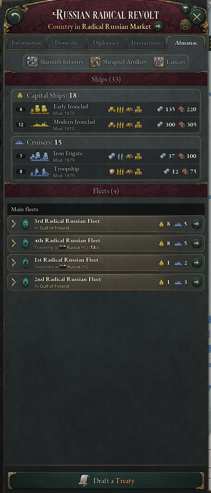
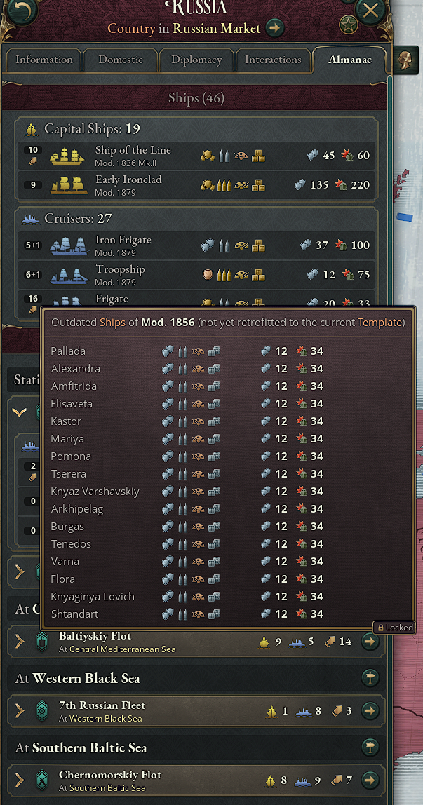

# Fleet Almanac

A lean UI mod for **Victoria 3** (1.14.x) that adds an **Almanac** tab to the country panel of every country (including your own), giving an overview of its navy:

- **Unit types**: one line with the newest unlocked combat unit type of each land group (infantry, artillery, cavalry) as image and name, hover for the unit type tooltip
- **Ships** by ship group, with one line per ship template (number of ships, type silhouette, ship type and template name, modifications sorted by slot, armor, hull damage); a marker below the number shows outdated ships of that template, hovering it lists them with their current equipment
- **Fleets** (main fleets first, then small fleets with less than 5% of the country's ships or fewer than 3 ships): one line per fleet (name, status including the current location, ships per ship group, open fleet) that expands to the same ship breakdown for that fleet

While the mouse is over the Almanac tab, the map switches to the military map mode (fleets, HQs, naval missions).

The mod is purely cosmetic: no scripted effects, nothing is written to the save game.

> This mod was developed with extensive AI assistance (Claude by Anthropic).

## Screenshots

| Ships and an expanded fleet | Outdated ships of a template |
|---|---|
|  |  |

## Structure

| Path | Purpose |
|---|---|
| `gui/00_fleet_almanac.gui` | Generated GUI file (do not edit by hand, see below) |
| `localization/english`, `localization/german` | Texts |
| `tools/build_fleet_almanac.ps1` | Build script that generates the GUI file |
| `.metadata/metadata.json`, `.metadata/thumbnail.png` | Launcher metadata and thumbnail |
| `docs/` | Screenshots for README and mod page |

## Rebuilding after a game update

`gui/00_fleet_almanac.gui` contains copies of vanilla types (`country_panel`, `tab_buttons`) and lists generated from the installed game (ship modification slots, land combat unit types with their unlocking technologies). After a game update, regenerate it:

```powershell
powershell -ExecutionPolicy Bypass -File tools\build_fleet_almanac.ps1
```

Use `-GameDir "<path>\Victoria 3\game"` if the game is not installed at the default path in the script. The script only reads the game files and aborts with a message if the vanilla files changed in a way that needs manual attention.

The file is named `00_...` on purpose: it must load before the vanilla `country_panel.gui`, because the first definition of a GUI type wins.
